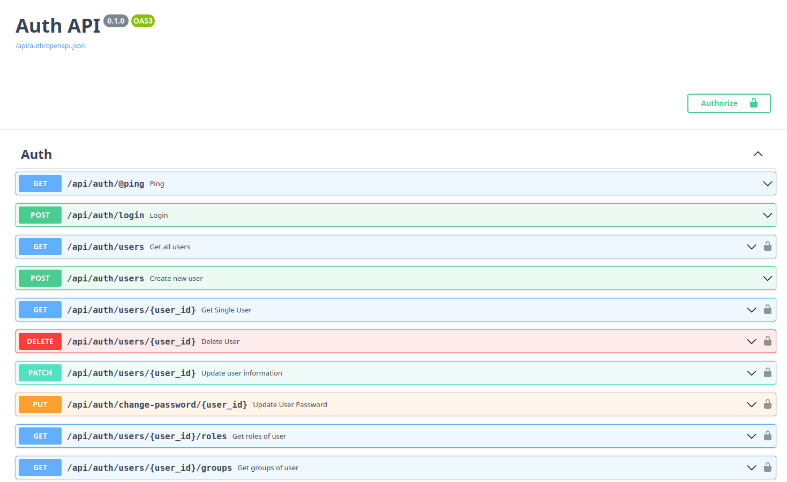

# Auth Microservice with Keycloak

This project is a microservice for authentication using FastAPI and python-keycloak.
It leverages the power of Keycloak for secure and robust authentication.

### What is keycloak

[Keycloak](https://www.keycloak.org) is an open-source Identity and Access Management solution. It provides features such as Single Sign-On (SSO), user federation, and centralized authentication management.

## Run Project

To run the project locally, follow these steps:

1. Activate environment
```shell
poetry shell
```

2. Install dependencies
```shell
poetry install
```

3. Run the server
```shell
poetry run app auth runserver
or app auth runserver
or make run
```

## Run tests
Execute the following commands to run tests and check code coverage:

1. Run tests
```shell
poetry run coverage run -m pytest -v tests
```

2. Check code test coverage
```shell
poetry run coverage report -m
```

# Routes

[](docs/keycloak-demo-endpoint.webm)

Feel free to explore and extend the functionality by adding more routes and features to suit your authentication needs.

# Contributing

Contributions are welcome! If you have any ideas or improvements, please open an issue or submit a pull request.
